<h1 align="center">Delivery App</h1>

<p align="center">
  <a href="#-technologies">Technologies</a>&nbsp;&nbsp;&nbsp;|&nbsp;&nbsp;&nbsp;
  <a href="#-project">Project</a>&nbsp;&nbsp;&nbsp;|&nbsp;&nbsp;&nbsp;
  <a href="#-layout">Layout</a>
  
</p>

<br>

## 🚀 Technologies


## 💻 Project

**Application for registering food delivery orders.** Users can create orders and manage delivery drivers. The interface was built using the [PrimeNG component library](https://primeng.org/), ensuring a modern and responsive user experience.

## 🔖 Layout

### 1. Orders

Project screen:

<p align="center">
  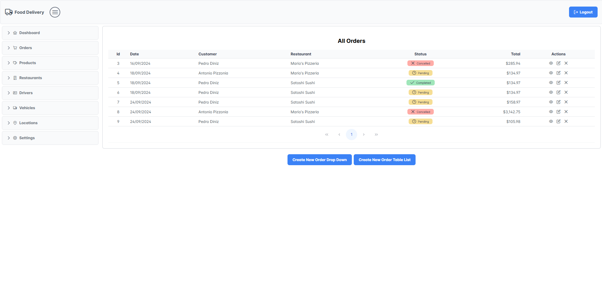
</p>

<p align="center">
  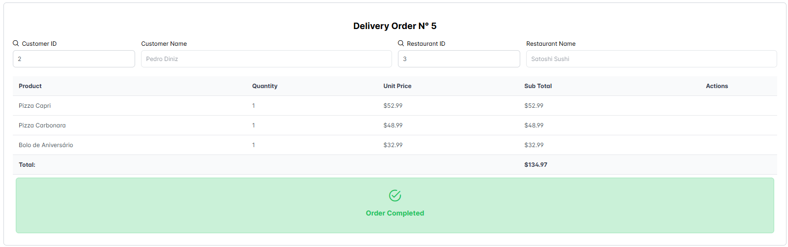
</p>

<p align="center">
  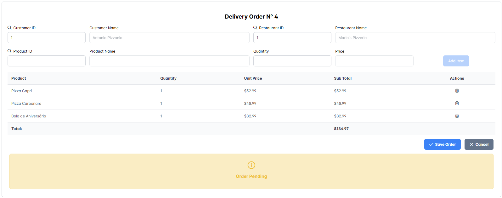
</p>

<p align="center">
  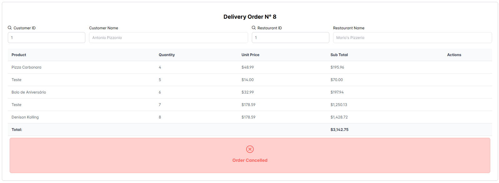
</p>

<p align="center">
  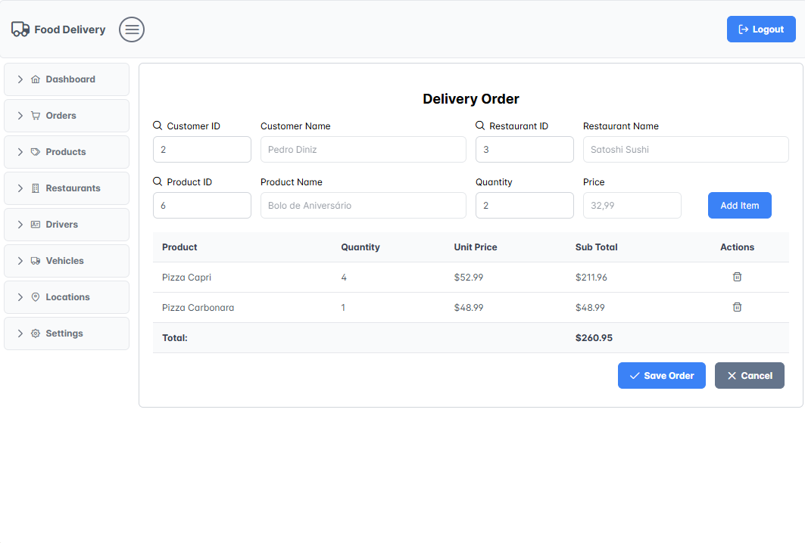
</p>

### 2. Products

Project screen:

<p align="center">
  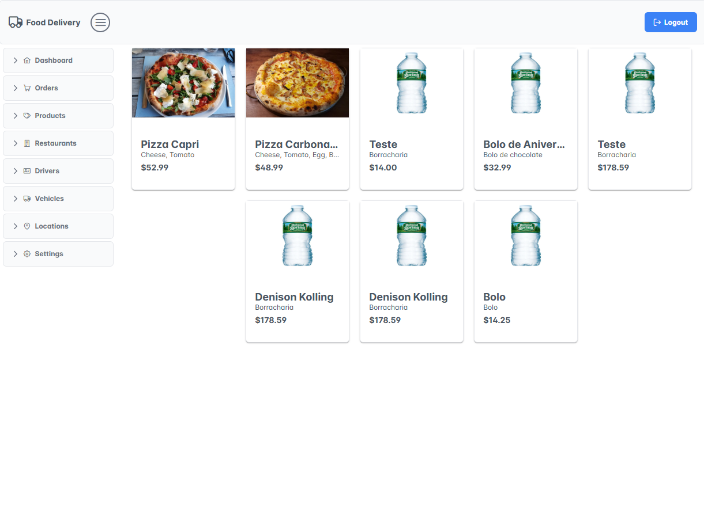
</p>

<p align="center">
  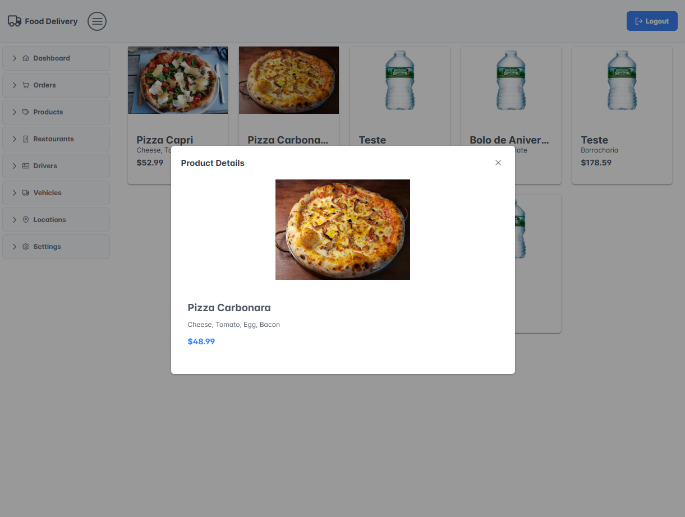
</p>

### 3. Dashboard

Project screen:

<p align="center">
  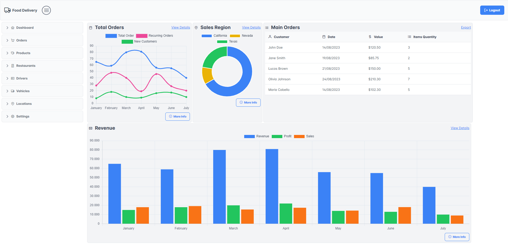
</p>

### 4. User Profile

Project screen:

<p align="center">
  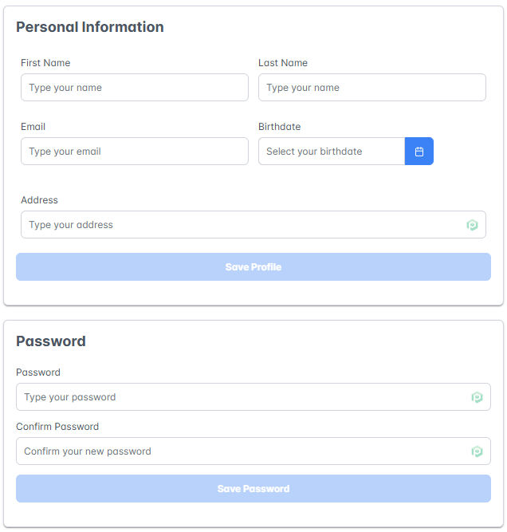
</p>

<p align="center">
  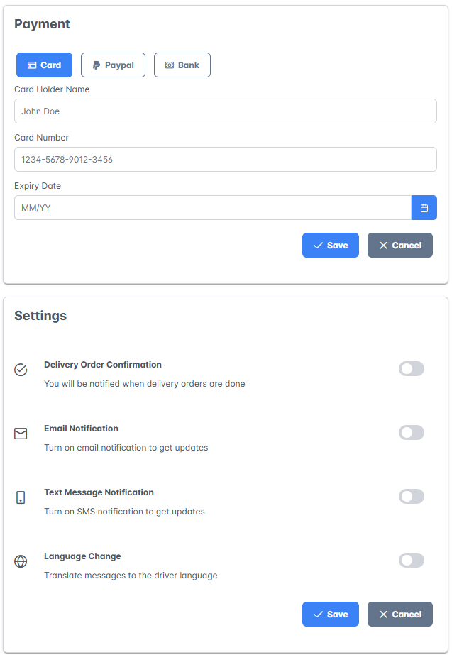
</p>

### 5. Driver

Project screen:

<p align="center">
  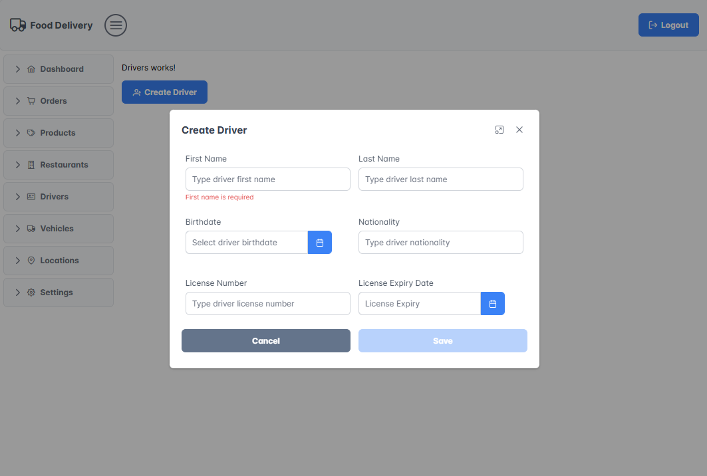
</p>

## 🚧 Prerequisites

# Running the API

To set up and run the API, use the following command:

```bash
json-server --watch db.json

---
```
